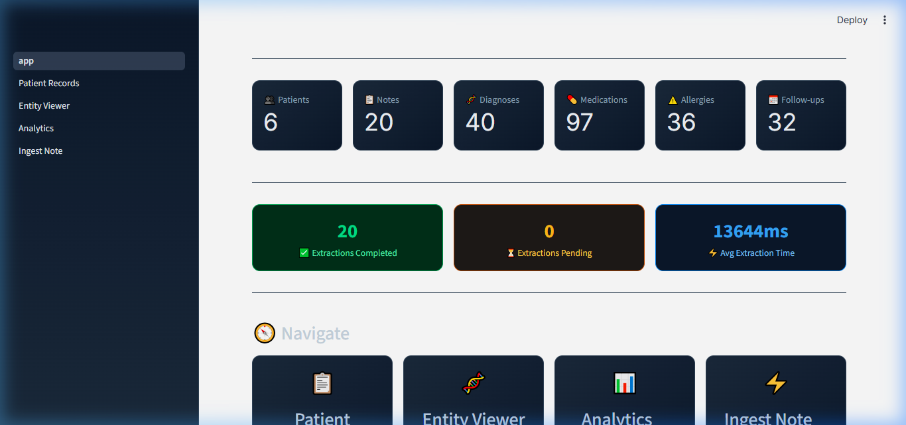
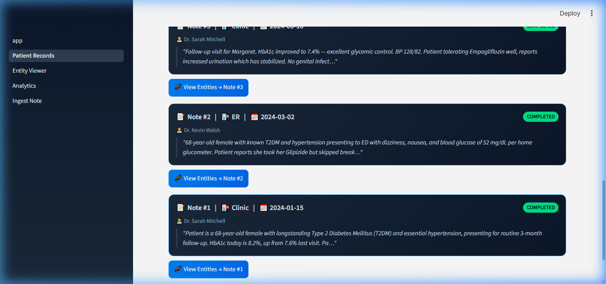
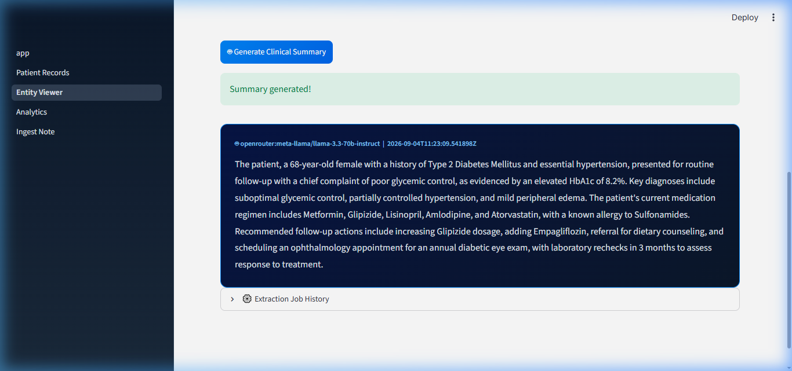
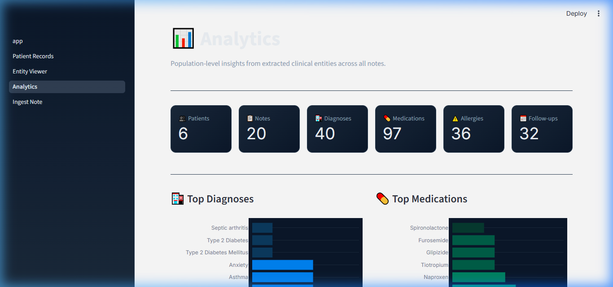
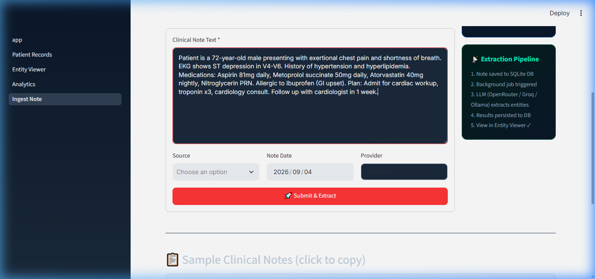
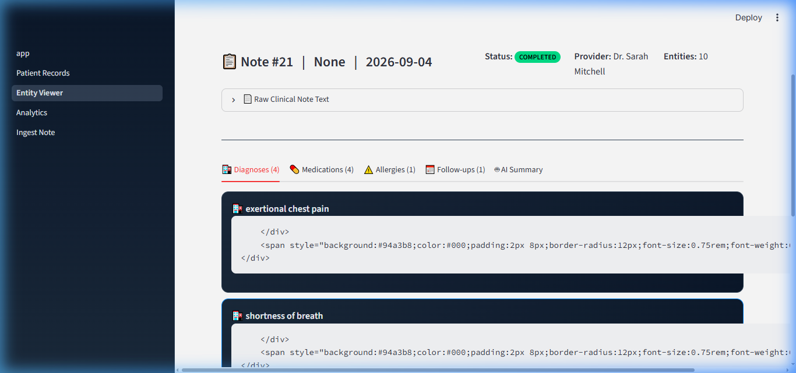

# 🏥 MedScribe — Clinical Notes AI Summarization Service

> **AI-powered clinical note processing** — ingest unstructured clinical text, extract structured medical entities (diagnoses, medications, allergies, follow-ups) using LLM-powered NLP, and explore insights through an interactive dashboard.

[](https://fastapi.tiangolo.com/)
[](https://streamlit.io/)
[](https://sqlite.org/)
[](https://docs.docker.com/compose/)
[](https://openrouter.ai/)

---

## ✨ Features

| Feature | Details |
|---------|---------|
| **8 REST Endpoints** | Full CRUD for patients + notes, full-text search, pagination |
| **LLM Extraction** | OpenRouter API → structured JSON (diagnoses, meds, allergies, follow-ups) |
| **Background Processing** | Note ingestion returns immediately; extraction runs async |
| **SQLite + SQLAlchemy 2.0** | 7 normalized tables with WAL mode for concurrent reads |
| **Pydantic v2 Validation** | Full request/response validation on every endpoint |
| **Streamlit Dashboard** | 4 pages: records, entity viewer, analytics, note ingestion |
| **Plotly Charts** | Interactive bar, pie, and donut charts with dark clinical theme |
| **Docker Compose** | Single-command deployment with health checks |
| **pytest Suite** | 15+ tests covering all endpoints |

---

## 📸 Interface & System Preview

Explore the MedScribe clinical dashboard and AI extraction workstation in action:

### 1. 🏠 Executive Clinical Operations Dashboard
> Real-time operational overview tracking total patient volume, clinical documentation throughput, entity counts, pipeline health (100% extraction success rate), and multi-provider LLM inference telemetry.



---

### 2. 📋 Longitudinal Patient Records & Encounter Timeline
> Patient cohort browser with instant search, demographic indexing, and interactive chronological clinical encounter history with expandable note details.



---

### 3. 🧬 Structured Medical Entity Extraction & AI Summarization
> Real-time medical entity parsing displaying categorized badges (diagnoses with ICD codes, medications with dosages and frequencies, verified allergies, and prioritized follow-ups) alongside on-demand LLM clinical synthesis.



---

### 4. 📊 Population Health & Diagnostic Analytics
> Interactive epidemiological intelligence built with Plotly, featuring top diagnosed conditions, medication utilization distributions, allergen frequencies, and note ingestion trends.



---

### 5. ⚡ Asynchronous Clinical Note Ingestion
> Direct clinical documentation portal allowing practitioners to select or register patients, paste raw consultation narratives, and dispatch background extraction jobs without blocking UI workflows.



---

### 6. 🔍 Real-Time Extracted Entities & Verification
> Immediate feedback view showing normalized clinical entities, severity classifications, and active LLM engine attribution (OpenRouter / Groq / Ollama).



---


## 🗂️ Project Structure

```
modmed-1/
├── backend/
│   ├── app/
│   │   ├── api/
│   │   │   ├── deps.py            # Shared dependencies (DB session, pagination)
│   │   │   └── routes/
│   │   │       ├── notes.py       # Clinical note endpoints
│   │   │       ├── patients.py    # Patient CRUD endpoints
│   │   │       └── stats.py       # Analytics endpoint
│   │   ├── core/
│   │   │   ├── config.py          # Pydantic Settings
│   │   │   └── logging.py         # Loguru structured logging
│   │   ├── db/
│   │   │   ├── database.py        # SQLAlchemy engine + session
│   │   │   └── models.py          # 7 ORM models
│   │   ├── schemas/               # Pydantic v2 request/response schemas
│   │   ├── services/
│   │   │   ├── llm_service.py     # OpenRouter LLM client
│   │   │   └── extraction_service.py  # Extraction orchestrator
│   │   └── main.py                # FastAPI app + router registration
│   ├── tests/                     # pytest test suite
│   ├── Dockerfile
│   └── requirements.txt
├── dashboard/
│   ├── app.py                     # Streamlit home page
│   ├── components/
│   │   └── utils.py               # API client + UI helpers + CSS
│   ├── pages/
│   │   ├── 1_Patient_Records.py   # Patient browser + note timeline
│   │   ├── 2_Entity_Viewer.py     # Entity cards + AI summary
│   │   ├── 3_Analytics.py         # Population charts
│   │   └── 4_Ingest_Note.py       # Note submission form
│   ├── Dockerfile
│   └── requirements.txt
├── data/
│   └── seed.py                    # 20 realistic clinical notes
├── docker-compose.yml
├── .env.example
├── Makefile
└── README.md
```

---

## 🚀 Quick Start

### Option A — Docker Compose (Recommended)

```bash
# 1. Clone and configure
git clone <your-repo-url>
cd modmed-1

# 2. Set up environment
cp .env.example .env
# Edit .env and add your OpenRouter API key:
#   OPENROUTER_API_KEY=sk-or-v1-your-key-here

# 3. Start all services
docker-compose up --build -d

# 4. Wait for services to be healthy, then seed
python data/seed.py

# Services:
#   API:       http://localhost:8000
#   API Docs:  http://localhost:8000/docs
#   Dashboard: http://localhost:8501
```

### Option B — Local Development

```bash
# 1. Backend setup
cd backend
python -m venv .venv
.venv\Scripts\activate        # Windows
# source .venv/bin/activate   # macOS/Linux
pip install -r requirements.txt

# 2. Configure
cp ../.env.example .env
# Edit .env and set OPENROUTER_API_KEY

# 3. Start backend
uvicorn app.main:app --reload --port 8000

# 4. Dashboard setup (new terminal)
cd dashboard
pip install -r requirements.txt
streamlit run app.py --server.port 8501

# 5. Seed data (new terminal)
python data/seed.py
```

---

## 🔑 Environment Variables

| Variable | Default | Description |
|----------|---------|-------------|
| `OPENROUTER_API_KEY` | *(required)* | Your OpenRouter API key |
| `LLM_MODEL` | `meta-llama/llama-3.3-70b-instruct` | Any OpenRouter model |
| `DATABASE_URL` | `sqlite:///./data/medscribe.db` | SQLite connection string |
| `DEBUG` | `false` | Enable SQL echo + debug logs |
| `API_URL` | `http://localhost:8000` | Dashboard → API URL |

---

## 📡 API Reference

### Patients

| Method | Endpoint | Description |
|--------|----------|-------------|
| `POST` | `/api/v1/patients/` | Create patient |
| `GET` | `/api/v1/patients/` | List patients (search, pagination) |
| `GET` | `/api/v1/patients/{id}` | Get patient |
| `PATCH` | `/api/v1/patients/{id}` | Update patient |
| `DELETE` | `/api/v1/patients/{id}` | Delete patient |
| `GET` | `/api/v1/patients/{id}/notes` | Patient note history |

### Clinical Notes

| Method | Endpoint | Description |
|--------|----------|-------------|
| `POST` | `/api/v1/notes/` | Ingest note + trigger extraction |
| `GET` | `/api/v1/notes/` | List notes (search, filter, pagination) |
| `GET` | `/api/v1/notes/{id}` | Note with all entities |
| `GET` | `/api/v1/notes/{id}/summary` | AI clinical summary |
| `DELETE` | `/api/v1/notes/{id}` | Delete note |

### Analytics

| Method | Endpoint | Description |
|--------|----------|-------------|
| `GET` | `/api/v1/stats/` | Aggregate dashboard stats |

### System

| Method | Endpoint | Description |
|--------|----------|-------------|
| `GET` | `/health` | Health check |
| `GET` | `/docs` | Swagger UI |

---

## 🧬 Database Schema

```
patients ──────────────────────────────────┐
  id, name, dob, gender, mrn, created_at   │
                                            │ (1:many)
clinical_notes ────────────────────────────┘
  id, patient_id, raw_text, note_date,      ──────────┐
  source, provider, created_at                         │ (1:many each)
                                                       │
  ├── diagnoses (id, note_id, code, description, severity)
  ├── medications (id, note_id, name, dosage, frequency, route)
  ├── allergies (id, note_id, allergen, reaction, severity)
  ├── follow_ups (id, note_id, task, due_date, priority)
  └── extraction_jobs (id, note_id, status, model_used, duration_ms, ...)
```

---

## 🧪 Running Tests

```bash
cd backend
pip install -r requirements.txt
pytest tests/ -v
```

---

## 🤖 LLM Extraction Pipeline

1. `POST /api/v1/notes/` → note saved, returns immediately with `extraction_status: pending`
2. FastAPI `BackgroundTasks` triggers `run_extraction_background(note_id)`
3. New DB session created for background context
4. OpenRouter API called with structured extraction prompt
5. JSON response parsed, entities persisted to all entity tables
6. `ExtractionJob` record updated with status + duration
7. `GET /api/v1/notes/{id}` returns note with populated entities

---

## 📊 Dashboard Pages

| Page | Description |
|------|-------------|
| 🏠 **Home** | Live stats, extraction health, navigation |
| 📋 **Patient Records** | Searchable patient grid, note timeline |
| 🧬 **Entity Viewer** | Entity cards by type, AI summary generation |
| 📊 **Analytics** | Population charts (diagnoses, meds, allergens, sources) |
| ⚡ **Ingest Note** | Submit notes with patient create/select flow |

---

## 🛠️ Makefile Commands

```bash
make up            # Start Docker services
make down          # Stop services
make seed          # Seed sample data
make test          # Run pytest
make logs          # Tail all logs
make clean         # Remove containers + DB
```

---

## 📝 License

MIT License — see [LICENSE](LICENSE) for details.

---

*Built with FastAPI, SQLAlchemy, OpenRouter, Streamlit, and Docker.*
